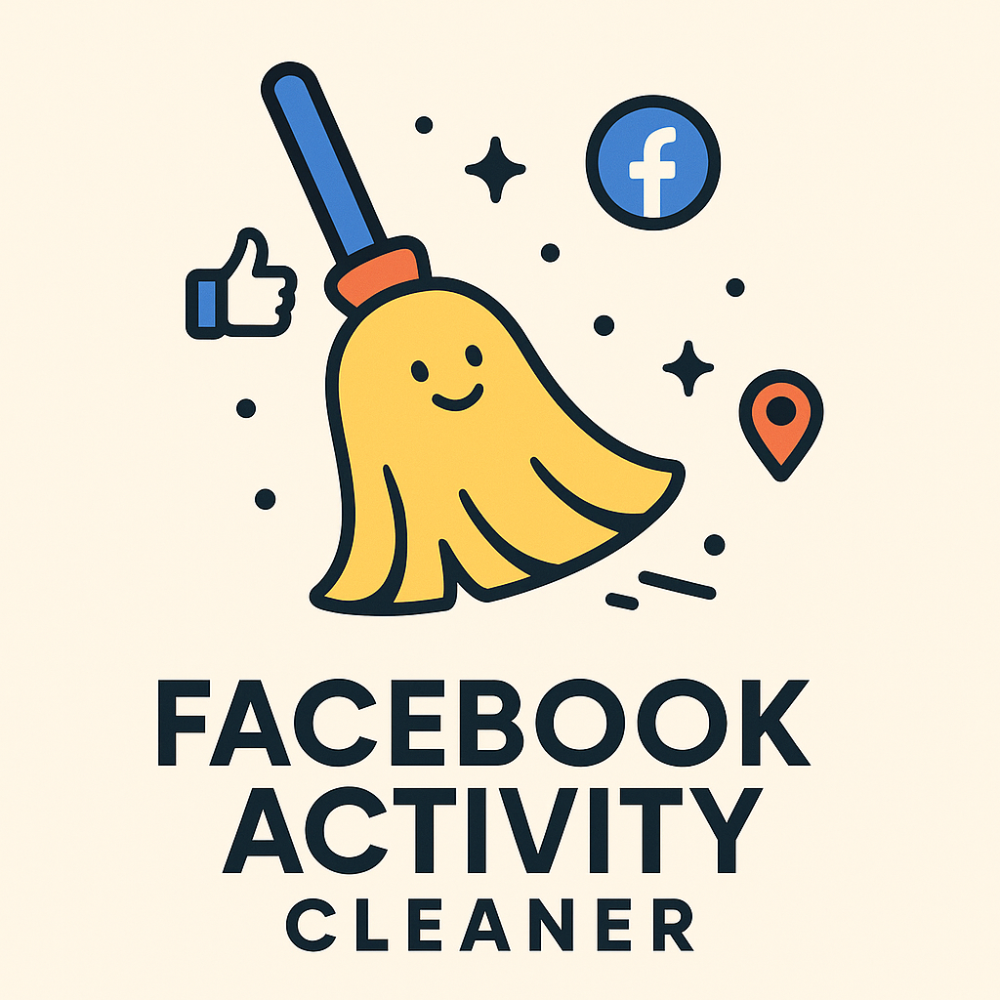

# 🧹 Facebook Activity Cleaner

<p align="center">
  
</p>

Tired of manually deleting your old posts, random likes, or past tags on Facebook? This script does it automatically for you, allowing you to automatically remove posts, likes, tags, and other elements from your activity history.

## 🚀 Features

- Automatically delete old posts
- Remove old likes
- Delete post tags
- Move items to trash
- Works with different types of activity and years
- Automated process with visible browser

## 📋 Prerequisites

- Node.js (version 14 or higher)
- npm (comes with Node.js)
- Google Chrome installed
- A Facebook account

## 🛠️ Installation

1. Clone this repository:
```bash
git clone https://github.com/mmelkings/fb-activity-cleaner.git
cd fb-activity-cleaner
```

2. Install dependencies:
```bash
npm install
```

## 📝 Preparation

Before running the script, you need to:

1. Open Google Chrome and log in to your Facebook account
   - This is important because the script will use your Chrome profile
   - If you don't log in first, the script will redirect to the login page and won't work properly

2. Get the Activity Log URL:
   - Go to your Facebook profile
   - Click on "Activity Log"
   - Select the year you want to clean using the filter
   - Select the type of activity if you want (posts, likes, etc.)
   - Copy the URL from your browser

3. Update the script:
   - Open `src/index.js`
   - Find the URL in the code and replace it with your copied URL
   - Save the file

## 🚀 Usage

Run the script with:

```bash
npm start
```

The script will:
1. Open a Chrome window
2. Navigate to your activity log
3. Start automatically deleting items

## ⚠️ Important Notes

1. The process takes time - be patient!

2. Facebook sometimes stops allowing deletion of all activity after extensive use:
   - If this happens, stop the script
   - Wait a while
   - Run it again later
   - This is normal and a Facebook limitation

3. You can use this script for:
   - Different years (just change the URL)
   - Specific types of activity (all activity, only posts, only likes, etc.)
   - Just update the URL accordingly

4. The script uses your existing Chrome profile:
   - Make sure you're logged into Facebook in Chrome
   - Don't use Chrome while the script is running
   - The script will open a new Chrome window

## 🤝 Contributing

Contributions, issues, and feature requests are welcome! Feel free to check the [issues page](https://github.com/mmelkings/fb-cleaner/issues).

## 📄 License

This project is licensed under the MIT License - see the [LICENSE](LICENSE) file for details. 